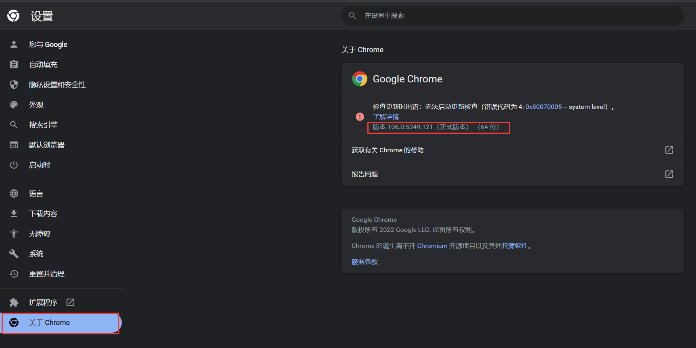
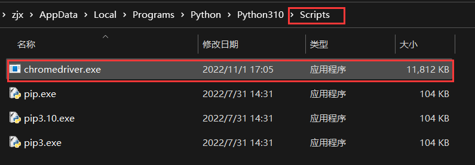
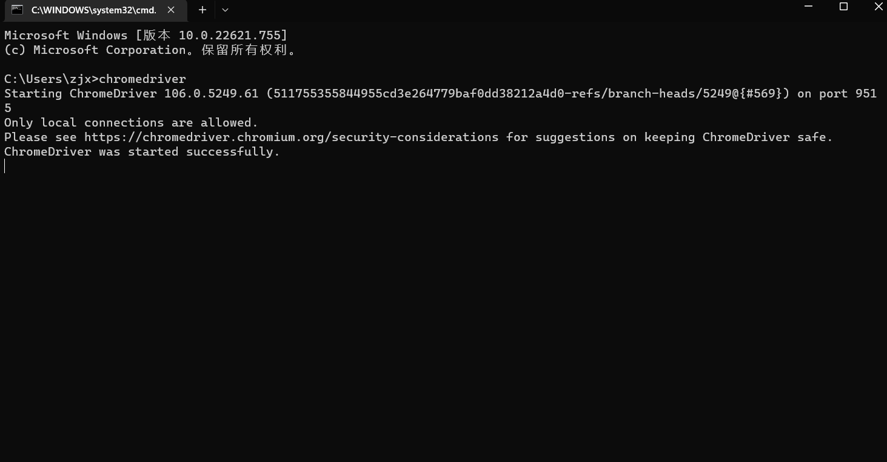
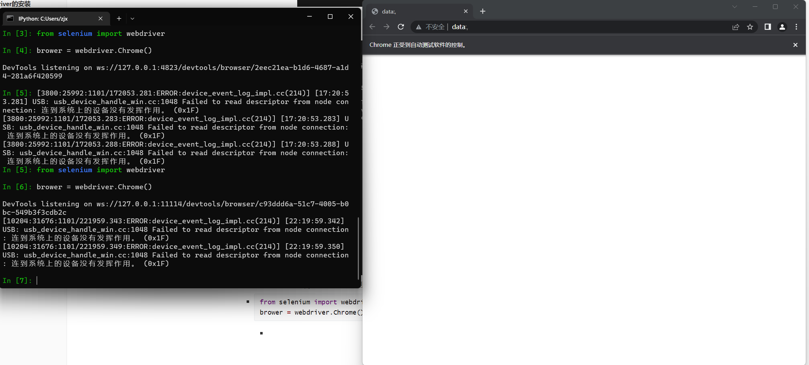

# python 爬虫

## 一. 开发环境配置

### 1. 请求库的安装

+ 爬虫可以简单分为几步：抓取页面、分析页面和存储数据
+ 在抓取页面的过程中，我们需要模拟浏览器向服务器发出请求，所以需要用到一些Python库来实现HTTP请求操作。这里使用到的第三方库有`requests`、`Selenium`、`aiohttp`等。

#### 1.1 requests安装

+ 由于requests属于第三方库，也就是Python默认不会自带这个库，所以需要我们手动安装。这里采用的是`pip3`的方法安装。

+ 验证安装

  + ```py
    import requests
    ```

  + 首先输入python3,进入命令行模式，然后输入上述内容，如果什么错误提示也没有，就证明已经成功安装了requests。

#### 1.2 Selenium 的安装

+ Selenium 是一个自动化测试工具，利用它我们可以驱动浏览器执行特定的动作，如点击、下拉等操作。这里采用的是`pip3`的方法安装。

+ 验证安装

  + ```python
    import selenium 
    ```

  + 后面需要配合浏览器来共工作

#### 1.3 ChromeDriver的安装

- 前面安装好的Selenium 需要ChromeDriver配合使用。因为只有安装ChromeDriver，才能驱动Chrome浏览器完成相应的操作。
- 安装步骤：
  1. 下载ChromeDriver
     - 官方网站:https://sites.google.com/a/chromium.org/chromedriver
     - 下载地址:https://chromedriver.storage.googleapis.com/index.html

  2. 查看chrome版本，并下载相对应的ChromeDriver版本，**如果没有可以下载相近的。**
     - 点击 Chrome 菜单“帮助”→“关于Google Chrome”,即可查看Chrome的版本号
     - 

  3. 环境变量配置
     - 在Windows下，建议直接将chromedriver.exe文件拖到Python的Scripts目录下，此外，也可以单独将其所在路径配置到环境变量。
     - 
     - 验证安装
     
       - 在 `cmd`下执行`chromedriver`
     
       - 
     
       - 随后执行一下的python代码进行测试
     
       - ```python
         from selenium import webdriver
         brower = webdriver.Chrome()
         ```
     
         - 
         - 运行之后，如果弹出一个空白的Chrome浏览器，则证明所有的配置都没有问题。如果没有弹出,请检查之前的每一步配置。
         - 如果弹出后闪退,则可能是 ChromeDriverer版本和 Chrome版本不兼容，请更换 ChromeDriver版本。
         - 如果没有问题,接下来就可以利用Chrome来做网页抓取了。
     
#### 1.4 GeckoDriver的安装 

+ 对于Firefox配置基本和chrome一样

+ 下载地址

  + GitHub: https://github.com/mozilla/geckodriver
  + 下载地址:https://github.com/mozilla/geckodriver/releases

+ 验证代码：

  + ```python
    from selenium import webdriver
    brower = webdriver.Firefox()
    ```

#### 1.5 PhantomJs（无界面浏览器）的安装

+ PhantomJS是一个无界面的、可脚本编程的WebKit浏览器引擎,它原生支持多种Web标准：DOM操作、CSS选择器、JSON、Canvas以及SVG。

+ Selenium支持 PhantomJS,这样在运行的时候就不会再弹出一个浏览器了。而且 PhantomJS的运行效率也很高,还支持各种参数配置，使用非常方便。下面我们就来了解一下 PhantomJS的安装过程。

+ 下载

  + https://phantomjs.org/download.html
  + 和上面安装过程一样 **将.exe文件放到 python的script文件中。**

+ 验证

  + 在`cmd`中执行 `phantomjs`

  + ```python
    from selenium import webdriver
    browser = webdriver. PhantomJS()
    browser.get(' https://www.baidu.com')
    print(browser.current_url)
    ```

  + 这里Selenium已经放弃了phantomjs，所以要使用上述代码进行检验需要 **卸载最新版本，下载低版本**

#### 1.6 aiohttp安装

+ 之前介绍的 requests库是一个阻塞式HTTP请求库,当我们发出一个请求后，程序会直等待服务器响应，直到得到响应后，程序才会进行下一步处理。其实，这个过程比较耗费时间。如果程序可以在这个等待过程中做一些其他的事情,如进行请求的调度、响应的处理等,那么爬取效率一定会大大提高。
+ aiohttp就是这样一个提供异步Web服务的库,从Python 3.5版本开始,Python中加入async/await关键字,使得回调的写法更加直观和人性化。aiohttp的异步操作借助于async/await关键字的写法变得更加简洁，架构更加清晰。使用异步请求库进行数据抓取时，会大大提高效率，下面我们来看一下这个库的安装方法。
+ 官方文档:http://aiohttp.readthedocs.io/en/stable
+ GitHub: https://github.com/aio-libs/aiohttp
+ PyPI: https://pypi.python.org/pypi/aiohttp
+ 安装
  + `pip3 install aiohttp`
  + 另外,官方还推荐安装如下两个库:个是字符编码检测库 cchardet,另一个是加速DNS的解析库aiodns。安装命令如下:
    + `pip3 install cchardet aiodns `
+ 验证
  + `import aiohttp`,在python下输入没有报错，则证明安装成功。

### 2. 基本库的使用

#### 2.1 urliib

+ request:这是最基本的 HTTP 请求模块，可以模拟请求的发送。就像在浏览器里输人网址然后按下回车一样，只需要给库方法传入 URL 以及额外的参数，就可以模拟实现发送请求的过程了。
+ error:异常处理模块。如果出现请求异常,那么我们可以捕获这些异常，然后进行重试或其他操作以保证程序运行不会意外终止。
+ parse;一个工具模块。提供了许多URL的处理方法，例如拆分、解析、合并等。
+ robotparser:主要用来识别网站的robots.txt文件，然后判断哪些网站可以爬,哪些网站不可以，它其实用得比较少。

##### 2.1.1 urlopen

+ **这里有些测试链接是自己搭建的服务\**本地进行的\*\***

+ ```py
  # -*- coding: UTF-8 -*-
  import urllib.request
  import urllib.parse
  
  
  # urlopen
  # urllib. request模块提供了最基本的构造HTTP请求的方法,利用这个模块可以模拟浏览器的请求发起过程，同时它还具有处理授权验证(Authentication )、重定向(Redirection )、浏览器Cookie以,及其他一些功能。
  
  
  # response = urllib.request.urlopen("https://www.python.org")
  
  # print(response.read().decode('utf-8'))
  
  # 响应是一个 HTTPResposne类型的对象，主要包含 read,readinto、 getheader.getheaders、 fileno 等方法，以及msg, version ,status. reason、debuglevel .closed等属性。
  # print(type(response))
  
  # urllib.request.urlopen(url,data=None, [timeout, ]*, cafile-None , capatheNone ,cadefault=False, context-None)
  # data 参数
  # timeout 参数 0.1
  # context 参数 该参数必须是ssl.SSLContext类型，用来指定SSL的设置。
  data = bytes(urllib.parse.urlencode({"id": 32}), encoding='utf-8')
  # post 请求，传参"id": 32
  try:
      response = urllib.request.urlopen("http://127.0.0.1:3000/idLightMsg", data=data, timeout=0.1)
  except urllib.error.URLError as e:
      if isinstance(e.reason.socket.timeout):
          print('time out')
  print(response.read().decode('utf-8'))
  ```

##### 2.1.2 Request

+ 利用urlopen方法可以发起最基本的请求,但1它那几个简单的参数并不足以构建一个完整的请求。如果需要往请求中加入 Headers等信息，就得利用更强大的Request类来构建请求了.
+ `class urllib.request.Request(url,data=None,headers=f, origin_req_host=None，unverifiable=False，method=None)`
  + 第一个参数url用于请求URL,这是必传参数，其他的都是可选参数。
  + 第二个参数data如果要传数据，必须传byttes,类型的。如果数据是字典，可以先用urllib.parse模块里的urlencode方法进行编码。
  + 第三个参数 headers是一个字典，这就是请求头，我们在构造请求时，既可以通过 headers参数直接构造此项，也可以通过调用请求实例的add header方法添加。添加请求头最常见的方法就是通过修改 User-Agent来伪装浏览器。默认的 User-Agent是Python-urllib,我们可以通过修改这个值来伪装浏览器.例如要伪装火狐浏览器.就可以把User-Ag:ent设置为:Mozilla/5.o (X11; u; Linux i686)Cecko/20071127Firefox/2.0.0.11
  + 第四个参数origin_req host指的是请求方的host名称或者IP地址。
  + 第五个参数 unverifiable表示请求是否是无法验证的，默认取值是False，意思是用户没有足够的权限来接收这个请求的结果。例如,请求一个HTML文档中的图片,但是没有自动抓取图像的权限，这时unverifiable的值就是Truea
  + 第六个参数method是一个字符串，用来指示请求使用的方法，例如 GET,POST和 PUT等。
  
+ ```python
  # -*- coding: UTF-8 -*-
  from urllib import request,parse
  # class urllib.request.Request(url,data=None,headers=f, origin_req_host=None，unverifiable=False，method=None)
  url = 'http://127.0.0.1:3000/idLightMsg'
  # headers = {
  #     'User-Agent': 'Mozi11a/4.0 (compatible; MSIE 5.5; Windows NT)',
  #     'Host': 'www.httpbin.org'
  # }
  
  dict = {"id": 32}
  data = bytes(parse.urlencode(dict), encoding='utf-8')
  # req = request.Request(url=url, data=data, headers=headers, method="POST")
  req = request.Request(url=url, data=data, method="POST")
  # 使用此方法记得将 “：” 变成  “，”
  req.add_header('User-Agent', 'Mozi11a/4.0 (compatible; MSIE 5.5; Windows NT)')
  response = request.urlopen(req)
  print(response.read().decode('utf-8'))
  ```

+ 高级用法

  + Handler可以理解为各种处理器，有专门处理登录验证的，处理Cookie的，处理代理设置的。利用这些Handler，我们几乎可以实现HTTP请求中所有的功能。

  + 会有各种Handler子类继承BaseHandler类，接下来举几个子类的例子如下：

    + HTTPDefaultErrorHandler用于处理HTTP响应错误，所有错误都会抛出HTTPError类型的异常。
    + HTTPRedirectHandler 用于处理重定向。
    + HTTPCookieProcessor 用于处理Cookie。
    + ProxyHandler用于设置代理，代理默认为空。
    + HTTPPasswordMgr用于管理密码,它维护着用户名密码的对照表。
    + HTTPBasicAuthHandler用于管理认证，如果一个链接在打开时需要认证，那么可以用这个类来解决认证问题。

  + Opener类可以提供open方法，该方法返回的响应类型和urlopen方法如出一辙。利用Handler类来构建Opener类。

  + **网站启用身份人证**

    + ```python
      from urllib.request import HTTPPasswordMgrWithDefaultRealm,HTTPBasicAuthHandler,build_opener
      from urllib.error import URLError
      
      username = 'admin'
      password = 'admin'
      url = 'https://ssr3.scrape.center'
      p = HTTPPasswordMgrWithDefaultRealm()
      p.add_password(None, url, username, password)
      auth_hander = HTTPBasicAuthHandler(p)
      opener = build_opener(auth_hander)
      
      try:
          result = opener.open(url)
          html = result.read().decode('utf-8')
          print(html)
      except URLError as  e:
          print(e.reason)
      ```

    + 上述代码首先实例了一个`HTTPBasicAuthHandler`对象 `auto_handler`,其中参数是`HTTPPasswordMgrWithDefaultRealm`对象，它利用 `add_password`方法添加用户名和密码，这二样就建立了一个用来处理验证的`Handler`类。

    + 然后将刚建立的`auth_handler`类作为参数传入`build_opener`方法，构建一个`Opener`，这个`Opener`在发送请求时就相当于已经验证成功了。

    + 最后利用`Opener`类中的open方法打开链接，即可完成验证。这里获取的结果就是验证成功后的页面源码内容。

+ 代理

  + 


## 二. 爬虫基础

### 2.1 Http基本原理

+ URI和URL

  + URI即统一资源标志符；URL即统一资源定位符。

+ GET和POST请求方法有如下区别

  + GET请求中的参数包含在URL里面，数据可以在URL中看到；而POST请求的URL不会包含这些数据，数据都是通过表单形式传输的，会包含在请求体中。
  + GET请求提交的数据最多只有1024字节，post方式则没有限制

  + 登录时一般需要提交用户名和密码，其中密码是敏感信息，如果使用GET方式请求，密码就会暴漏在URL里面，造成密码泄露，所以这时候最好以POST方式发送。上传文件时，由于文件内容比较大，一次也会选POST方式。
  + GET：请求页面并返回页面内容。
  + HEAD：类似于GET请求，只不过返回的响应中没有具体内容，用于获取报头
  + POST：大多用于提交表单或上传文件，数据包含咋子请求体中
  + PUT：用客户端传向服务器的数据取代指定文档中的内容
  + DELETE：请求服务器删除指定的页面
  + CONNECT：把服务器当作跳板，让服务器代替客户端访问其他网页
  + OPTIONS：允许客户端查看服务端的性能
  + TRACE：回显服务器收到的请求。主要用于测试或诊断。

+ 请求的网址：

  + 请求的网址，它可以唯一确定客户端向请求的资源。

#### 2.1.1 请求头：

  + 请求头，用来说明服务器要使用的附加信息，比较重要的信息有Cookie、Refere、User-Agent等。
  + Accept：请求报头域，用于指定客户端可接受那些类型的信息。
  + Accept-Language： 用于指定客户端可接受的语言类型。
  + Accept-Encoding：用于致电给客户端可接受的内容编码。
  + Host：用于指定请求资源的主机IP和端口号，其内容为请求URL的原始服务器或网关的位置。
    + 从HTTP1.1版本开始，请求必须包含此内容。
  + Cookie：也常用复数形式Cookies，这是网站未来辨别用户，进行会话跟踪而存储在用户本地的数据。它的主要功能时维持当前访问会话。
  + Refer：用于表示请求是从哪个页面发过来的，服务器可以拿到这以信息并做相应的处理，如做来源统计，防盗链处理等。
  + User-Agent：简称UA，这是一个特殊的字符串头，可以使服务器识别客户端使用的操作系统及版本、浏览器及版本等信息。做爬虫时如果加上此信息，可以伪装为浏览器；如果不加，很可能会被识别出来。
  + Content-type：也叫互联网媒体类型或者MIME类型，在HTTP协议消息头中，它用来表示具体请求中的媒体类型信息。
    + text/html代表HTML格式，image/gif代表GIF图片，application/json代表JSON类型。

#### 2.1.2 请求体：

  + 请求体，一般承载的内容时POST请求中的表单数据，对于GET请求，请求体为空。
  + 登录之前,需要先填写用户名和密码信息，登录时这些内容会以表单数据的形式提交给服务器,此时需要注意Request Headers中指定Content-Type为application/x-www-form-urlencoded。只有这样设置Content-Type,内容才会以表单数据的形式提交。另外,也可以将Content-Type设置为appolication/json来提交JSON 数据,或者设置为multipart/form-data来上传文件。
  + |           Content-Type            | POST提交数据的方式表单数据 |
    | :-------------------------------: | :------------------------: |
    | application/x-www-form-urlencoded |          表单数据          |
    |        multipart/form-data        |        表单文件上传        |
    |         application/json          |       序列化JSON数据       |
    |              texUxml              |          XML数据           |

#### 2.1.3 响应（状态码）：

  + 响应,即 Response,由服务器返回给客户端,可以分为三部分:响应状态码( Response Status Code),响应头( Response Headers)和响应体(Response Body)。

  + 响应状态码

    + | 状态码 |      说明       |                             详情                             |
      | :----: | :-------------: | :----------------------------------------------------------: |
      |  100   |      继续       | 请求者应当继续提出请求。服务器已接收到请求的部分，正在等待其余部分 |
      |  101   |    切换协议     |      请求者已要求服务器切换协议，服务器已确认并准备切换      |
      |  200   |      成功       |                    服务器已成功处理了请求                    |
      |  201   |     已创建      |               请求成功并且服务器创建了新的资源               |
      |  202   |     已接受      |                 服务器已接收请求，但尚未处理                 |
      |  203   |   非授权信息    |     服务器已成功处理了请求,但返回的信息可能来自另一个源      |
      |  204   |     无内容      |           服务器成功处理了请求，但没有返回任何内容           |
      |  205   |    重置内容     |               服务器成功处理了请求,内容被重置                |
      |  206   |    部分内容     |                   服务器成功处理了部分请求                   |
      |  300   |    多种选择     |                针对请求，服务器可执行多种操作                |
      |  301   |    永久移动     |          请求的网页已永久移动到新位置，即永久重定向          |
      |  302   |    临时移动     |          请求的网页暂时跳转到其他页面，即暂时重定向          |
      |  303   |  查看其他位置   |     如果原来的请求是 POST，重定向目标文档应该通过GET提取     |
      |  304   |     未修改      |        此次请求返回的网页未经修改，继续使用上次的资源        |
      |  305   |    使用代理     |                 请求者应该使用代理访问该网页                 |
      |  307   |   临时重定向    |                 临时从其他位置响应请求的资源                 |
      |  400   |    错误请求     |                     服务器无法解析该请求                     |
      |  401   |     未授权      |               请求没有进行身份验证或验证未通过               |
      |  403   |    禁止访问     |                       服务器拒绝此请求                       |
      |  404   |     未找到      |                    服务器找不到请求的网页                    |
      |  405   |    方法禁用     |                 服务器禁用了请求中指定的方法                 |
      |  406   |     不接收      |               无法使用请求的内容响应请求的网页               |
      |  407   |  需要代理授权   |                    请求者需要使用代理授权                    |
      |  408   |    请求超时     |                        服务器请求超时                        |
      |  409   |      冲突       |                  服务器在完成请求时发生冲突                  |
      |  410   |     已删除      |                     请求的资源已永久删除                     |
      |  411   |  需要有效长度   |          服务器不接收不含有效内容长度标头字段的请求          |
      |  412   | 未满足前提条件  |        服务器未满足请求者在请求中设置的某一个前提条件        |
      |  413   |  请求实体过大   |              请求实体过大,超出服务器的处理能力               |
      |  414   |   请求URL过长   |                 请求网址过长,服务器无法处理                  |
      |  415   |   不支持类型    |                   请求格式不被请求页面支持                   |
      |  416   |  请求范围不符   |                    页面无法提供请求的范围                    |
      |  417   |  为满足期望值   |              服务器未满足期望请求标头字段的要求              |
      |  500   | 服务器 内部错误 |                 服务器遇到错误,无法完成请求                  |
      |  501   |     未实现      |                  服务器不具备完成请求的能力                  |
      |  502   |    错误网关     |       服务器作为网关或代理,接收到上游服务器的无效响应        |
      |  503   |   服务不可用    |                      服务器目前无法使用                      |
      |  504   |    网关超时     |     服务器作为网关或代理，没有及时从上游服务器接收到请求     |
      |  505   | HTTP版本不支持  |             服务器不支持请求中使用的HTTP协议版本             |

    

#### 2.1.4 响应头

+ 响应头,包含了服务器对请求的应答信息,如 Content-Type ,Server 、Set-Cookie等。
  + Date:用于标识响应产生的时间。
  + Last-Modified:用于指定资源的最后修改时间
  + Content-Encoding:用于指定响应内容的编码。
  + Server:包含服务器的信息,例如名称、版本号等。
  + Content-Type:文档类型，指定返回的数据是什么类型，如 text/html代表返回 HTML 文档application/x-javascript代表返回JavaScript文件,image/jpeg 代表返回图片。
  + Set-Cookie:设置Cookie,响应头中的Set-Cookie用于告诉浏览器需要将此内容放在Cookie中,下次请求时将Cookie携带上。
  + Expires:用于指定响应的过期时间，可以让代理服务器或浏览器将加载的内容更新到缓存中。当再次访问相同的内容时,就可以直接从缓存中加载，达到降低服务器负载、缩短加载时间的目的。

#### 2.1.5 响应体

+ 响应体，这可以说是最关键的部分了，响应的正文数据都存在于响应体中，例如请求网页时，响应体就是网页的HTML 代码;请求一张图片时，响应体就是图片的二进制数据。我们做爬虫请求网页时,要解析的内容就是响应体。

### 2.2 HTTP 2.0

+ 前面我们也提到了,HTTP协议从2015年起发布了2.0版本，相比 HTTP 1.I来说,HTTP2.0变得更快、更简单、更稳定。HTTP2.0在传输层做了很多优化,它的主要目标是通过支持完整的请求与响应复用来减少延迟，并通过有效压缩HTTP请求头字段的方式将协议开销降至最低,同时增加对请求优先级和服务器推送的支持，这些优化一笔勾销了HTTP I.1为做传输优化想出的一系列“歪招”。
+ 二进制分帧层
  + HTTP 2.0所有性能增强的核心就在于这个新的二进制分帧层。在HTTP 1x 中,不管是请求(Request)还是响应(Response)，它们都是用文本格式传输的，其头部(Headers)、实体Body)之间也是用文本换行符分隔开的。HTTP2.0对其做了优化,将文本格式修改为了二进制格式使得解析起来更加高效。同时将请求和响应数据分割为更小的帧，并采用二进制编码。
  + 帧:只存在于 HTTP 2.0中的概念，是数据通信的最小单位。比如一个请求被分为了请求头帧(Request Headers Frame)和请求体/数据帧(Request Data Frame )。
  + 数据流:一个虚拟通道，可以承载双向的消息，每个流都有一个唯一的整数ID来标识。
  + 消息:与逻辑请求或响应消息对应的完整的一系列帧。
+ 多路复用
  + 在HTTP1.x中，如果客户端想发起多个并行请求以提升性能，则必须使用多个TCP连接，而且浏览器为了控制资源,还会对单个域名有6~8个TCP连接请求的限制。但在HTTP2.0中,由于有了二进制分帧技术的加持,HTTP 2.0不用再以 TCP连接的方式去实现多路并行了，客户端和服务器可以将HTTP消息分解为互不依赖的帧,然后交错发送,最后再在另一端把它们重新组装起来,达到以下效果。
    + 并行交错地发送多个请求，请求之间互不影响。
    + 并行交错地发送多个响应,响应之间互不千扰。
    + 使用一个连接并行发送多个请求和响应不必再为绕过 HTTP 1.x限制而做很多工作。
    + 消除不必要的延迟和提高现有网络容量的利用率,从而减少页面加载时间。
    + 这样一来,整个数据传输性能就有了极大提升
    + 同域名只需要占用一个TCP连接，使用一个连接并行发送多个请求和响应,消除了多个TCP连接带来的延时和内存消耗。
    + 并行交错地发送多个请求和响应,而且它们之间互不影响。
    + 在HTTP2.0中，每个请求都可以带一个31位的优先值,0表示最高优先级，数值越大优先级越低。有了这个优先值,客户端和服务器就可以在处理不同的流时采取不同的策略了,以最优的方式发送流、消息和帧。
+ 流控制
  + 流控制是一种阻止发送方向接收方发送大量数据的机制,以免超出后者的需求或处理里能力。可以理解为、接收方太繁忙了，来不及处理收到的消息了，但是发送方还在一直大量发送消息，这样就会出现一些问题。比如,客户端请求了一个具有较高优先级的大型视频流，但是用户已经暂停观看视频了，客户端现在希望暂停或限制从服务器的传输，以免提取和缓冲不必要的数据。再比如，一个代理服务器可能具有较快的下游连接和较慢的上游连接，并且也希望调节下游连接传输数据的速度以匹配上游连接的速度，从而控制其资源利用率等。
  + HTTP是基于TCP实现的,虽然TCP原生有流控制机制,但是由于HTTP2.0数据流在一个 TCP连接内复用，TCP流控制既不够精细，也无法提供必要的应用级API来调节各个数据流的传。
  + 为了解决这一问题,HTTP2.0提供了组简单的构建块,这些构建块允许客户端和服务器实现它们自己的数据流和连接级流控制。
    + 流控制具有方向性。每个接收方都可以根据自身需要选择为每个数据流和整个连接设置任意的窗口大小。
    + 流控制的窗口大小是动态调整的。每个接收方都可以公布其初始连接和数据流流控制窗口以字节为单位),当发送方发出 DATA帧时窗口减小，在接收方发出WINDOw_UPDATE帧时窗口增大。
    + 流控制无法停用。建立HTTP2.0连接后，客户端将与服务器交换SETTINGS帧，这会在两个方向上设置流控制窗口。流控制窗口的默认值设为65535字节，但是接收方可以设置一个较大的最大窗口大小(`2^11-1`字节)并在接收到任意数据时通过发送WINDOM_UPDATE帧来维持这一大小。
    + 由此可见，HTTP 2,0提供了简单的构建块,实现了自定义策略来灵活地调节资源使用和分配逻辑,同时提升了网页应用的实际性能和感知性能。
+ 服务端推送
  + HTTP2.0新增的另—个强大的功能是:服务器可以对一个客户端请求发送多个响应换句话说,除了对最初请求的响应外，服务器还可以向客户端推送额外资源，而无须客户端明确地请求。


### 2.3 爬虫的基本原理

+ 获取网页
+ 提取信息
+ 保存信息
+ 自动化程序

### 2.4 代理的基本原理

+ 代理的作用
  + 突破自身IP的访问限制,访问一些平时不能访问的站点。
  + 访问一些单位或团体的内部资源。比如,使用教育网内地址段的免费代理服务器，就可以下载和上传对教育网开放的各类FTP,也可以查询、共享各类资料等。
  + 提高访问速度。通常,代理服务器会设置一个较大的硬盘缓冲区,当有外界的信息通过时,会同时将其保存到自己的缓冲区中，当其他用户访问相同的信息时,直接从缓冲区中取出信息,提高了访问速度。
  + 隐藏真实IP:上网者可以通过代理隐藏自己的IP,免受攻击。对于爬虫来说，使用代理就是为了隐藏自身IP,防止自身的P被封锁。
+ 代理分类
  + 根据代理得 协议，代理可以分为如下几类：
    + FTP代理服务器:主要用于访问FTP服务器，一般有上传、下载以及缓存功能,端口一般为21、2121等。
    + HTTP代理服务器:主要用于访问网页，一般有内容过滤和缓存功能,端口一般为80、8080,3128等。
    + SSL/TLS代理:主要用于访问加密网站、一般有SSL或TLS加密功能(最高支持128位加密强度)、端口一般为443,
    + RTSP代理:主要用于Realplayer访问Real流媒体服务器，一般有缓存功能,端口一般为554。
    + Telnet代理:主要用于Telnet远程控制(黑客入侵计算机时常用于隐藏身份),端口一般为23。POP3/SMTP代理:主要用于以POP3/SMTP方式收发邮件，一般有缓存功能,端口一般为110/25。
    + SOCKS代理:只是单纯传递数据包，不关心具体协议和用法，所以速度快很多，一般有缓存功能，端口一般为1080。SOCKS代理协议又分为SOCKS4和 SOCKS5，SOCKS4协议只支持TCP,sOCKS5协议则支持TCP和UDP，还支持各种身份验证机制、服务器端域名解析等。简单来说，SOCKS4能做到的SOCKS5都能做到，但 SOCKS5能做到的 SOCKs4不一定做得到。
  + 根据匿名程度区分
    + **高度匿名代理**:高度匿名代理会将数据包原封不动地转发,在服务端看来似乎真的是一个普通客户端在访问,记录的IP则是代理服务器的IP。
    + **普通匿名代理**:普通匿名代理会对数据包做一些改动,服务端可能会发现正在访问自己的是个代理服务器.并且有一定概率去追查客户端的真实IP。这里代理服务器通常会加人的HTTP头有HTTP_ VIA 和 HTTP_ X FORWARDED_FOR。
    + **透明代理**:透明代理不但改动了数据包，还会告诉服务器客户端的真实IP。这种代理除了能用缓存技术提高浏览速度、用内容过滤提高安全性之外,并无其他显著作用,最常见的例子是内网中的硬件防火墙。
    + **间谍代理**:间谍代理是由组织或个人创建的代理服务器,用于记录用户传输的数据,然后对记录的数据进行研究,监控等。
  + 常见的代理方式
    + 对于网上的免费代理,最好使用高度匿名代理,可以在使用前把所有代理都抓取下来筛选一下可用代理，也可以进一步维护一个代理池。
    + 使用付费代理服务。互联网上存在许多可以付费使用的代理商，质量要比免费代理好很多。
    + ADSL拨号，拨一次号换一次IP,稳定性高，也是一种比较有效的封锁解决方案。
    + 蜂窝代理，即用4G或5G网卡等制作的代理。由于用蜂窝网络作为代理的情形较少，因此整体被封锁的概率会较低,但搭建蜂窝代理的成本是较高的。

### 2.5 Python中的多线程和多进程

+ Python中 GIL的限制导致不论是在单核还是多核条件下,同一时刻都只能运行一个线程,这使得Python多线程无法发挥多核并行的优势。
+ GIL全称为Global Interpreter Lock，意思是全局解释器锁，其设计之初是出于对数据安全的考虑。在 Python多线程下、每个线程的执行方式分如下三步：
  + 获取DIL
  + 执行对应线程的代码
  + 释放DIL
+ 

